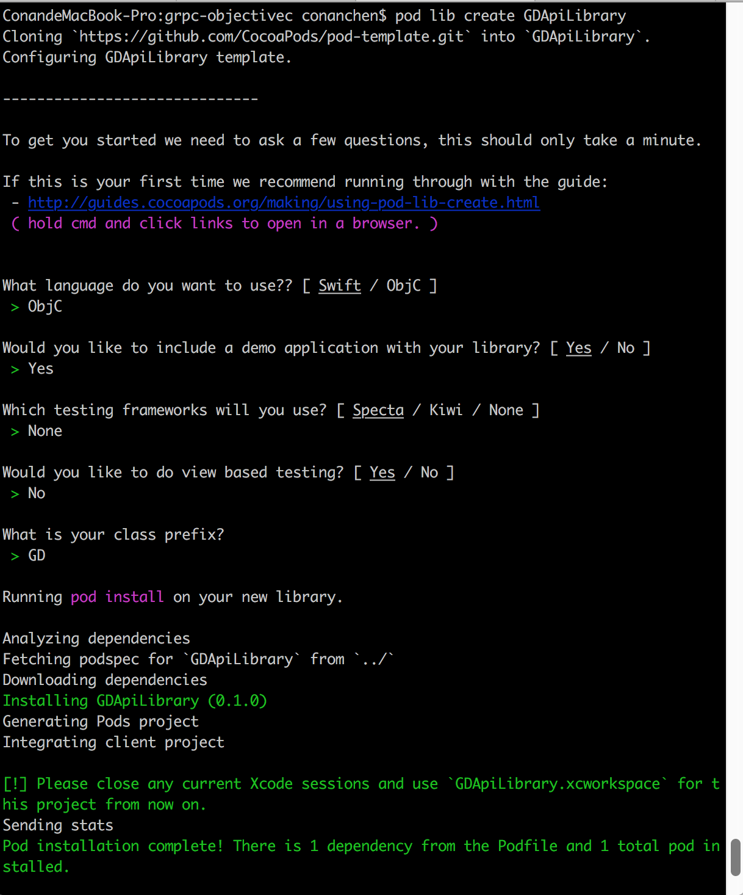

version master

# Step 1. Add the JitPack repository to your build file
Add it in your root build.gradle at the end of repositories:
```gradle
allprojects {
    repositories {
        ...
        maven { url 'https://jitpack.io' }
    }
}
```
	
# Step 2. Add the dependency
## For Public Android APP

```gradle
dependencies {
    compile 'com.github.conanchen.gedit-api:grpc-javalite:master-SNAPSHOT'
}
```
		
## For Java Application(Client or Server)
    
```gradle
dependencies {
    compile 'com.github.conanchen.gedit-api:grpc-java:master-SNAPSHOT'
}
```
	
# Building ahead of time
You can also build snapshots on each commit if you add GitHub Webhooks.

To add, head to repository Settings -> Webhooks & Services -> Add webhook.

Webhook URL: https://jitpack.io/api/webhooks

Content type: application/json

The webhook will trigger a build for branches that you have previously used with JitPack. So make sure you have requested master-SNAPSHOT from JitPack before adding a webhook.

# objectc install
$ git config --global http.proxy http://127.0.0.1:50312
$ pod install

# 本地开启VPN后，Gt也需要设置代理，才能正常略过GFW，访问goole code等网站
  git config --global http.proxy http://127.0.0.1:50312
  git config --global https.proxy https://127.0.0.1:50312
  git config --global http.proxy 'socks5://127.0.0.1:50311' 
  git config --global https.proxy 'socks5://127.0.0.1:50311'
  
  取消
  git config --global --unset http.proxy
  git config --global --unset https.proxy
  
  
# [Create and Distribute Private Libraries with Cocoapods](https://medium.com/@shahabejaz/create-and-distribute-private-libraries-with-cocoapods-5b6507b57a03)
## Step 1: Create your [gedit-specs](https://github.com/conanchen/gedit-specs.git) Podspec Repository on Github  
```
 echo “# gedit-specs” >> README.md
 git init
 git add README.md
 git commit -m “first commit”
 git remote add origin https://github.com/conanchen/gedit-specs.git
 git push -u origin master
```
## Step 2: Add your [gedit-specs](https://github.com/conanchen/gedit-specs.git) Private Podspec Repository to your CocoaPods Installation
```
pod repo add gedit-specs https://github.com/conanchen/gedit-specs.git
cd ~/.cocoapods/repos/gedit-specs
pod repo lint .
```
## Step 4: Generate [GDApiLibrary] Pod Project under folder grpc-objectivec of [gedit-api-grpc](https://github.com/conanchen/gedit-api-grpc) repo
```
cd ~/gedit/gedit-api-grpc
mkdir grpc-objectivec
pod lib create GDApiLibrary
```

检查podspec
```
ConandeMacBook-Pro:grpc-objectivec conanchen$ cd GDApiLibrary/
ConandeMacBook-Pro:GDApiLibrary conanchen$ pwd
/Users/conanchen/gedit/gedit-api-grpc/grpc-objectivec/GDApiLibrary
ConandeMacBook-Pro:GDApiLibrary conanchen$ pod lib lint GDApiLibrary.podspec

 -> GDApiLibrary (0.1.0)

GDApiLibrary passed validation.
ConandeMacBook-Pro:GDApiLibrary conanchen$
```

## Step5: Add code to project
```
cd GDApiLibrary/GDApiLibrary/Classes/
vi AKGitViewControllers.h
```
//  AKGitViewControllers.h
```
//  AKGitViewControllers.h
#import <UIKit/UIKit.h>
 
@interface AKGitViewControllers : UIViewController
 
- (void)placeALabelOnVC;
 
@end
```
```

cd GDApiLibrary/GDApiLibrary/Classes/
vi AKGitViewControllers.m
```
//  AKGitViewControllers.m
```
//  AKGitViewControllers.m
#import "AKGitViewControllers.h"
 
@implementation AKGitViewControllers
 
- (void)viewDidLoad {
    [self placeALabelOnVC];
}
 
- (void)placeALabelOnVC{
    UILabel *lbl = [[UILabel alloc] initWithFrame:CGRectMake(0, self.view.frame.size.height/2, self.view.frame.size.width, 20)];
    lbl.textAlignment = NSTextAlignmentCenter;
    lbl.text = @"This is a testing of pods";
    [self.view addSubview:lbl];
}
 
@end
```
## Step6: Test Added Code
If any issues there (like file not found from the pod) then use the pod install command to update the code with that example project. because we have added some files in pod.
```
pod install
```
Test your example is working or not.

## Step7: Make your Pod [GDApiLibrary] Available in Public
### Step 7a: Tagging
```
cd ~/gedit/gedit-api-grpc/grpc-objectivec/GDApiLibrary
git tag ‘0.0.1’
git push origin 0.0.1
```
The name of the tag should match s.version in your .podspec file. The next step will validate this.
```
Pod::Spec.new do |s|
  s.name             = 'GDApiLibrary'
  s.version          = '0.0.1'
  s.summary          = 'Gedit API GDApiLibrary.'

```

Validate again with pod spec lint.
```
ConandeMacBook-Pro:GDApiLibrary conanchen$ pod spec lint GDApiLibrary.podspec

 -> GDApiLibrary (0.0.1)

Analyzed 1 podspec.

GDApiLibrary.podspec passed validation.

ConandeMacBook-Pro:GDApiLibrary conanchen$
```
### Step 7b: Push to Spec Repo, refer to step 1
```
ConandeMacBook-Pro:GDApiLibrary conanchen$ pod repo push gedit-specs GDApiLibrary.podspec

Validating spec
 -> GDApiLibrary (0.0.1)

Updating the `gedit-specs' repo

Already up to date.

Adding the spec to the `gedit-specs' repo

 - [Add] GDApiLibrary (0.0.1)

Pushing the `gedit-specs' repo

ConandeMacBook-Pro:GDApiLibrary conanchen$
```
### Step 7c: Now you can see that this pod repo is referenced in your spec repo (as shown below).
```
ConandeMacBook-Pro:GDApiLibrary conanchen$ cd ~/.cocoapods/repos/gedit-specs/GDApiLibrary/
ConandeMacBook-Pro:GDApiLibrary conanchen$ ls
0.0.1
ConandeMacBook-Pro:GDApiLibrary conanchen$
```
## Step 8: Share It with Your Team
### Step 8a: Ask teammembers to add the private repo [gedit-specs] to their local Cocoapods installation with the command:

```
pod repo add gedit-specs https://github.com/conanchen/gedit-specs.git

```
### Step 8b: edit Podfile
```
source 'https://github.com/conanchen/gedit-specs.git'

target 'GDApiLibrary_Example' do
    pod 'GDApiLibrary', '~> 0.0.1' 
...
```
# Congratulations!


# Pagination
## [Paginating Real-Time Data with Cursor Based Pagination](https://www.sitepoint.com/paginating-real-time-data-cursor-based-pagination/)
## [Pagination: You're (Probably) Doing It Wrong.](https://coderwall.com/p/lkcaag/pagination-you-re-probably-doing-it-wrong)
